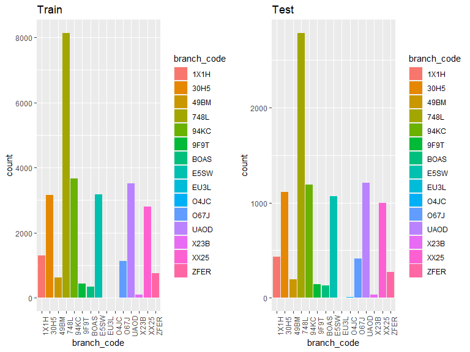

Load libraries

```r
library(tidyverse)
library(readr)
library(lubridate)
library(gridExtra)
```

Load Data

```r
train <- read.csv("Train.csv")
test <- read.csv("Test.csv")
#format date
train$join_date <- as_date(train$join_date, format = "%d/%m/%Y")
test$join_date <- as_date(test$join_date, format = "%d/%m/%Y")
```

Format data

```r
#format categorical variables as factors
#for (i in 9:29){
#    train[,i] <-  factor(as.character(train[,i]), levels = c("0", "1"), labels = c("No", "Yes"))
#}
train$sex <- factor(train$sex)
train$marital_status <- factor(train$marital_status)
#train$birth_year <- factor(train$birth_year)
train$branch_code <- factor(train$branch_code)
train$occupation_code <- factor(train$occupation_code)
train$occupation_category_code <- factor(train$occupation_category_code)

test$sex <- factor(test$sex)
test$marital_status <- factor(test$marital_status)
#test$birth_year <- factor(test$birth_year)
test$branch_code <- factor(test$branch_code)
test$occupation_code <- factor(test$occupation_code)
test$occupation_category_code <- factor(test$occupation_category_code)

#examine NAs
colnames(train)[colSums(is.na(train)) > 0]
colnames(test)[colSums(is.na(test)) > 0]

train[is.na(train[,"join_date"]),]
test[is.na(test[,"join_date"]),]

#remove rows with NAs
train <- train[complete.cases(train),]
test <- test[complete.cases(test),]

#Add time elapsed
train$duration <- 2020 - year(train$join_date)
test$duration <- 2020 - year(test$join_date)
```

Summary Statistics

```r
#format categorical variables as factors
train_fct <- train
for (i in 9:29){
    train_fct[,i] <-  factor(as.character(train_fct[,i]), levels = c("0", "1"), labels = c("No", "Yes"))
}
summary(train_fct)
```

```
##       ID              join_date          sex       marital_status 
##  Length:29130       Min.   :2010-05-01   F: 8803   M      :22912  
##  Class :character   1st Qu.:2017-07-01   M:20327   S      : 3267  
##  Mode  :character   Median :2018-08-01             U      : 2473  
##                     Mean   :2018-03-01             W      :  301  
##                     3rd Qu.:2019-06-01             D      :  135  
##                     Max.   :2020-08-01             R      :   34  
##                                                    (Other):    8  
##    birth_year    branch_code   occupation_code occupation_category_code
##  Min.   :1932   748L   :8135   2A7I   : 7089   56SI: 3655              
##  1st Qu.:1973   94KC   :3658   0KID   : 3969   90QI: 5552              
##  Median :1980   UAOD   :3507   SST3   : 2711   AHH5:  102              
##  Mean   :1980   E5SW   :3185   UJ5T   : 2079   JD7X:  576              
##  3rd Qu.:1987   30H5   :3151   0OJM   : 1564   L44T:  627              
##  Max.   :2011   XX25   :2805   BPSA   : 1091   T4MS:18618              
##                 (Other):4689   (Other):10627                           
##   P5DA        RIBP       X8NN1       X7POT       X66FJ        GYSR      
##  No :29090   No :27351   No :28973   No :28814   No :28791   No :29126  
##  Yes:   40   Yes: 1779   Yes:  157   Yes:  316   Yes:  339   Yes:    4  
##                                                                         
##                                                                         
##                                                                         
##                                                                         
##                                                                         
##   SOP4        RVSZ        PYUQ        LJR9        N2MW        AHXO      
##  No :28699   No : 3803   No :26957   No :28776   No :28292   No :28591  
##  Yes:  431   Yes:25327   Yes: 2173   Yes:  354   Yes:  838   Yes:  539  
##                                                                         
##                                                                         
##                                                                         
##                                                                         
##                                                                         
##   BSTQ        FM3X        K6QO        QBOL        JWFN        JZ9D      
##  No :28806   No :29020   No : 7502   No :22298   No :28820   No :27705  
##  Yes:  324   Yes:  110   Yes:21628   Yes: 6832   Yes:  310   Yes: 1425  
##                                                                         
##                                                                         
##                                                                         
##                                                                         
##                                                                         
##   J9JW        GHYX        ECY3          duration    
##  No :27712   No :28228   No :28030   Min.   : 0.00  
##  Yes: 1418   Yes:  902   Yes: 1100   1st Qu.: 1.00  
##                                      Median : 2.00  
##                                      Mean   : 2.28  
##                                      3rd Qu.: 3.00  
##                                      Max.   :10.00  
## 
```


```r
#format categorical variables as factors
test_fct <- test
for (i in 9:29){
    test_fct[,i] <-  factor(as.character(test_fct[,i]), levels = c("0", "1"), labels = c("No", "Yes"))
}
summary(test_fct)
```

```
##       ID              join_date          sex      marital_status   birth_year  
##  Length:9999        Min.   :2010-05-01   F:3155   M      :7878   Min.   :1933  
##  Class :character   1st Qu.:2017-06-01   M:6844   S      :1116   1st Qu.:1973  
##  Mode  :character   Median :2018-07-01            U      : 842   Median :1980  
##                     Mean   :2018-02-28            W      : 105   Mean   :1980  
##                     3rd Qu.:2019-07-01            D      :  51   3rd Qu.:1987  
##                     Max.   :2020-07-01            R      :   5   Max.   :2001  
##                                                   (Other):   2                 
##   branch_code   occupation_code occupation_category_code  P5DA       RIBP     
##  748L   :2783   2A7I   :2404    56SI:1262                No :9994   No :9699  
##  UAOD   :1207   0KID   :1465    90QI:1927                Yes:   5   Yes: 300  
##  94KC   :1191   SST3   : 943    AHH5:  29                                     
##  30H5   :1114   UJ5T   : 697    JD7X: 191                                     
##  E5SW   :1069   0OJM   : 542    L44T: 208                                     
##  XX25   : 999   BPSA   : 397    T4MS:6382                                     
##  (Other):1636   (Other):3551                                                  
##  X8NN1      X7POT      X66FJ       GYSR       SOP4       RVSZ       PYUQ     
##  No :9963   No :9935   No :9925   No :9998   No :9921   No :5271   No :9534  
##  Yes:  36   Yes:  64   Yes:  74   Yes:   1   Yes:  78   Yes:4728   Yes: 465  
##                                                                              
##                                                                              
##                                                                              
##                                                                              
##                                                                              
##   LJR9       N2MW       AHXO       BSTQ       FM3X       K6QO       QBOL     
##  No :9921   No :9859   No :9899   No :9897   No :9970   No :5975   No :8499  
##  Yes:  78   Yes: 140   Yes: 100   Yes: 102   Yes:  29   Yes:4024   Yes:1500  
##                                                                              
##                                                                              
##                                                                              
##                                                                              
##                                                                              
##   JWFN       JZ9D       J9JW       GHYX       ECY3         duration     
##  No :9933   No :9679   No :9676   No :9813   No :9766   Min.   : 0.000  
##  Yes:  66   Yes: 320   Yes: 323   Yes: 186   Yes: 233   1st Qu.: 1.000  
##                                                         Median : 2.000  
##                                                         Mean   : 2.283  
##                                                         3rd Qu.: 3.000  
##                                                         Max.   :10.000  
## 
```

## Train vs Test
Join Date

```r
year_train <- as.character(year(train$join_date))
month_train <- month(train$join_date, label = TRUE)
year_month <- paste(month_train, year_train)

p1 <- data.frame(year_month) %>% mutate(year_month = zoo::as.yearmon(year_month, "%b %Y")) %>%
    group_by(year_month) %>% summarise(count = length(year_month)) %>% ggplot(aes(x = year_month, y = count)) + geom_line()
```

```
## `summarise()` ungrouping output (override with `.groups` argument)
```

```r
year_test <- as.character(year(test$join_date))
month_test <- month(test$join_date, label = TRUE)
year_month_test <- paste(month_test, year_test)

p2 <- data.frame(year_month_test) %>% mutate(year_month = zoo::as.yearmon(year_month_test, "%b %Y")) %>%  group_by(year_month) %>% summarise(count = length(year_month)) %>% ggplot(aes(x = year_month, y = count)) + geom_line() 
```

```
## `summarise()` ungrouping output (override with `.groups` argument)
```

```r
grid.arrange(p1, p2, nrow = 2)
```

<!-- -->

Male vs Female

```r
p3 <- train %>% ggplot(aes(sex, fill = sex)) + geom_bar() + ggtitle("Train")
p4 <- test %>% ggplot(aes(sex, fill = sex)) + geom_bar() + ggtitle("Test")
grid.arrange(p3, p4, ncol = 2) 
```

<!-- -->
Marital Status

```r
p5 <- train %>% ggplot(aes(marital_status, fill = marital_status)) + geom_bar() + ggtitle("Train")
p6 <- test %>% ggplot(aes(marital_status, fill = marital_status)) + geom_bar() + ggtitle("Test")
grid.arrange(p5, p6, ncol = 2) 
```

<!-- -->
Birth Year

```r
p7 <- train %>% ggplot(aes(birth_year)) + geom_bar() + ggtitle("Train")
p8 <- test %>% ggplot(aes(birth_year)) + geom_bar() + ggtitle("Test") + scale_x_continuous(limits = c(min(train$birth_year), max(train$birth_year)))
grid.arrange(p7, p8, nrow = 2)
```

<!-- -->
Years elapsed since joined

```r
p13 <- train %>% ggplot(aes(duration)) + geom_bar() + ggtitle("Train")
p14 <- test %>% ggplot(aes(duration)) + geom_bar() + ggtitle("Test")
grid.arrange(p13, p14, nrow = 2)
```

<!-- -->
Branch Code

```r
p9 <- train %>% ggplot(aes(branch_code, fill = branch_code)) + geom_bar() + ggtitle("Train")
p10 <- test %>% ggplot(aes(branch_code, fill = branch_code)) + geom_bar() + ggtitle("Test") 
grid.arrange(p9, p10, ncol = 2)    
```

<!-- -->
Occupation Code Category

```r
p11 <- train %>% ggplot(aes(occupation_category_code, fill = occupation_category_code)) + geom_bar() + ggtitle("Train")
p12 <- test %>% ggplot(aes(occupation_category_code, fill = occupation_category_code)) + geom_bar() + ggtitle("Test")
grid.arrange(p11, p12, ncol = 2)
```

<!-- -->
## Parameters vs Products

Correlation Matrix

```r
corr_matrix <- cor(train[,c(5,9:30)])
corrplot::corrplot(corr_matrix, order = "FPC", method = "circle", type = "lower", tl.cex = 0.6, tl.col = "black")
```

<!-- -->
    
Join date vs Products


Sex vs Products

```r
train %>% group_by(sex) %>% select(P5DA:ECY3) %>% summarise_all(sum)
```

```
## Adding missing grouping variables: `sex`
```

```
## # A tibble: 2 x 22
##   sex    P5DA  RIBP X8NN1 X7POT X66FJ  GYSR  SOP4  RVSZ  PYUQ  LJR9  N2MW  AHXO
##   <fct> <int> <int> <int> <int> <int> <int> <int> <int> <int> <int> <int> <int>
## 1 F        17   351    48    96    71     0    77  7463   689   114   238   146
## 2 M        23  1428   109   220   268     4   354 17864  1484   240   600   393
## # ... with 9 more variables: BSTQ <int>, FM3X <int>, K6QO <int>, QBOL <int>,
## #   JWFN <int>, JZ9D <int>, J9JW <int>, GHYX <int>, ECY3 <int>
```
